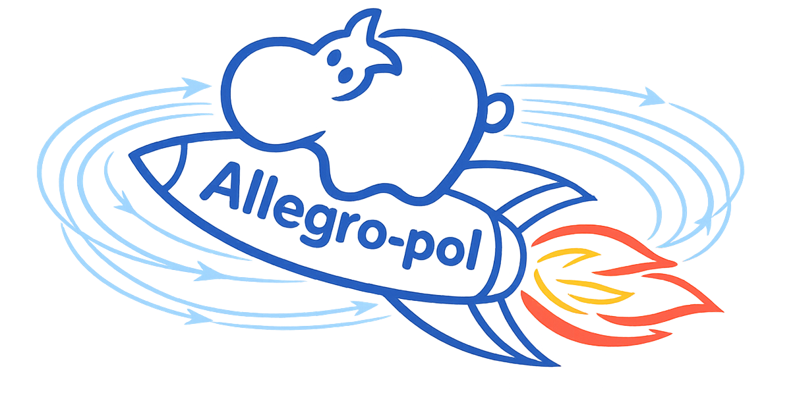

<p align="center">

</p>

# allegro-pol

`allegro-pol` is an extension package of the `nequip` framework that adapts the Allegro architecture (another `nequip` extension package) for the prediction of the electric response of materials (polarization, Born charges, polarizability) in addition to energy and forces within a single ML model.
The ideas are described in ["Unified differentiable learning of electric response"](https://www.nature.com/articles/s41467-025-59304-1).

## Installation

It is strongly recommended to create a fresh virtual environment. For example,
```
conda create -n allegro-pol python=3.12
conda activate allegro-pol
```

Then, install `allegro-pol`, which will install all essential dependencies (including `nequip` and `nequip-allegro`).
```
git clone https://github.com/mir-group/allegro-pol.git
cd allegro-pol
pip install -e .
```

Users may wish to install additional dependencies such as the Weights and Biases package for logging.
```
pip install wandb
```

## Packaging and Compilation

`allegro-pol` is compatible with NequIP's packaging and compilation workflows:

- Packaging with [`nequip-package`](https://nequip.readthedocs.io/en/latest/guide/getting-started/workflow.html#packaging)
- Compilation with [`nequip-compile`](https://nequip.readthedocs.io/en/latest/guide/getting-started/workflow.html#compilation)

### Package a trained model

```bash
nequip-package build path/to/model.ckpt path/to/model.nequip.zip
```

### Compile for ASE

Use the `allegro-pol` ASE target to generate a compiled model for `allegro_pol.integrations.ase.NequIPPolCalculator`:

```bash
nequip-compile \
  path/to/model.ckpt \
  path/to/compiled_model.nequip.pt2 \
  --device cuda \
  --mode aotinductor \
  --target ase_pol_bc
```

Then load it with the `allegro-pol` ASE calculator:

```python
from allegro_pol.integrations.ase import NequIPPolCalculator

calculator = NequIPPolCalculator.from_compiled_model(
    compile_path="path/to/compiled_model.nequip.pt2",
    device="cuda",  # or "cpu"
)
```

### Compile for TorchSim

Use the `allegro-pol` batched target to generate a compiled model for
`allegro_pol.integrations.torchsim.NequIPPolTorchSimCalc`:

```bash
nequip-compile \
  path/to/model.ckpt \
  path/to/compiled_model.nequip.pt2 \
  --device cuda \
  --mode aotinductor \
  --target batch_pol_bc
```

Then load it with the `allegro-pol` TorchSim calculator:

```python
from allegro_pol.integrations.torchsim import NequIPPolTorchSimCalc

calculator = NequIPPolTorchSimCalc.from_compiled_model(
    compile_path="path/to/compiled_model.nequip.pt2",
    device="cuda",  # or "cpu"
)
```

### Compile for LAMMPS pair styles

Use an `allegro-pol` LAMMPS target with `nequip-compile` for pair-style integrations:

```bash
nequip-compile \
  path/to/model.ckpt \
  path/to/compiled_model.nequip.pt2 \
  --device cuda \
  --mode aotinductor \
  --target pair_allegro_pol
```

If Born charges and polarizability are needed in outputs, use:

```bash
nequip-compile \
  path/to/model.ckpt \
  path/to/compiled_model_bc.nequip.pt2 \
  --device cuda \
  --mode aotinductor \
  --target pair_allegro_pol_bc
```

For installation and usage of LAMMPS pair styles, see [`pair_nequip_allegro`](https://github.com/mir-group/pair_nequip_allegro).

## Example

BaTiO3 data and an associated config file are provided for training, which is all based on the `nequip` framework with minor extensions.
The data is located at `data/BaTiO3.xyz` and the example config is located at `configs/BaTiO3.yaml`.
```
nequip-train configs/BaTiO3.yaml
```

## Pre- and Post-Processing Scripts

Pre- and post-processing scripts can be found in `scripts`, along with a tutorial on how to use them.

## Cite

If you use this code in your own work, please cite:

 1. The paper introducing the unified differentiable electric-response model: [Unified differentiable learning of electric response](https://www.nature.com/articles/s41467-025-59304-1)
```
@article{falletta2025unified,
  title={Unified differentiable learning of electric response},
  author={Falletta, Stefano and Cepellotti, Andrea and Johansson, Anders and Tan, Chuin Wei and Descoteaux, Marc L and Musaelian, Albert and Owen, Cameron J and Kozinsky, Boris},
  journal={Nature Communications},
  volume={16},
  number={1},
  pages={4031},
  year={2025},
  publisher={Nature Publishing Group UK London}
}
```

 2. The [preprint describing the NequIP software framework](https://arxiv.org/abs/2504.16068)
```
@article{tan2025high,
  title={High-performance training and inference for deep equivariant interatomic potentials},
  author={Tan, Chuin Wei and Descoteaux, Marc L and Kotak, Mit and Nascimento, Gabriel de Miranda and Kavanagh, Se{\'a}n R and Zichi, Laura and Wang, Menghang and Saluja, Aadit and Hu, Yizhong R and Smidt, Tess and Johansson, Anders and Witt, William C. and Kozinsky, Boris and Musaelian, Albert},
  journal={arXiv preprint arXiv:2504.16068},
  year={2025}
}
```

Also consider citing:

 1. The [original Allegro paper](https://www.nature.com/articles/s41467-023-36329-y)
```
@article{musaelian2023learning,
  title={Learning local equivariant representations for large-scale atomistic dynamics},
  author={Musaelian, Albert and Batzner, Simon and Johansson, Anders and Sun, Lixin and Owen, Cameron J and Kornbluth, Mordechai and Kozinsky, Boris},
  journal={Nature Communications},
  volume={14},
  number={1},
  pages={579},
  year={2023},
  publisher={Nature Publishing Group UK London}
}
```

 2. The [original NequIP paper](https://www.nature.com/articles/s41467-022-29939-5)
```
@article{batzner20223,
  title={E (3)-equivariant graph neural networks for data-efficient and accurate interatomic potentials},
  author={Batzner, Simon and Musaelian, Albert and Sun, Lixin and Geiger, Mario and Mailoa, Jonathan P and Kornbluth, Mordechai and Molinari, Nicola and Smidt, Tess E and Kozinsky, Boris},
  journal={Nature communications},
  volume={13},
  number={1},
  pages={2453},
  year={2022},
  publisher={Nature Publishing Group UK London}
}
```

 3. The `e3nn` equivariant neural network package used by NequIP, through its [preprint](https://arxiv.org/abs/2207.09453) and/or [code](https://github.com/e3nn/e3nn)
